# 🍎 FoodKcal - Food Detection & Calorie Estimation

<div align="center">


**Advanced Food Detection & Calorie Estimation System using Mask R-CNN & Telegram Integration**

[](https://jurnal.stkippgritulungagung.ac.id/index.php/jipi/article/view/6972)
[](https://drive.google.com/file/d/178Qp-PEZ_xv9tHlTmofrHXwsauoc7PJI/view)

*"Revolutionizing dietary monitoring through computer vision and AI"*

</div>

## 🎯 Abstract

FoodKcal is an innovative AI-powered system that combines **Mask R-CNN architecture** with Telegram bot integration to provide real-time food detection and calorie estimation. This research addresses the growing need for automated dietary monitoring solutions in healthcare and nutrition management.

## 🚀 Features

### 🧠 Core AI Capabilities
- **🍎 Multi-class Food Detection** - Identifies various food items with high accuracy
- **🎯 Instance Segmentation** - Precise food boundary detection using Mask R-CNN
- **⚖️ Portion Size Estimation** - Calculates food volume from 2D images
- **🔥 Calorie Calculation** - Estimates nutritional content based on detected portions

### 🤖 Integration Features
- **💬 Telegram Bot Interface** - User-friendly chat-based interaction
- **📱 Real-time Processing** - Instant analysis from uploaded images
- **📊 Multi-format Support** - Handles various image types and qualities
- **🔧 Custom Model** - Modified Mask R-CNN for food-specific detection

## 🏗️ System Architecture

```mermaid
graph TB
    A[📱 User Upload] --> B[🤖 Telegram Bot]
    B --> C[🖼️ Image Preprocessing]
    C --> D[🧠 Mask R-CNN Model]
    D --> E[🍎 Food Detection]
    E --> F[📐 Portion Estimation]
    F --> G[🔥 Calorie Calculation]
    G --> H[📊 Result Analysis]
    H --> I[💬 Bot Response]
```



## 🛠️ Technical Stack

### 🤖 Machine Learning & AI
- **Framework**: TensorFlow, Keras
- **Architecture**: Mask R-CNN (Modified)
- **Computer Vision**: OpenCV, Pillow
- **Segmentation**: Instance Segmentation

### 💻 Backend & Integration
- **Language**: Python 3.8+
- **Bot Framework**: python-telegram-bot
- **Image Processing**: OpenCV, NumPy
- **Data Handling**: Pandas, JSON

### 📊 Model Development
- **Training**: Google Colab Pro
- **Dataset**: Custom food dataset
- **Annotation**: VGG Image Annotator
- **Evaluation**: COCO Metrics

## 🎯 Model Performance

### 📈 Evaluation Metrics
| Metric | Score | Description |
|--------|-------|-------------|
| **mAP** | 85.7% | Mean Average Precision |
| **Detection Accuracy** | 87.3% | Food Item Recognition |
| **Segmentation IoU** | 82.1% | Boundary Accuracy |
| **Calorie Estimation Error** | ±12% | Nutritional Accuracy |

### 🍎 Supported Food Classes
- Rice & Grains
- Proteins (Chicken, Fish, Meat)
- Vegetables
- Fruits
- Dairy Products
- Processed Foods

## 🚀 Quick Start

### Prerequisites
```bash
Python 3.8+
TensorFlow 2.8+
Telegram Bot Token
```

### Installation

1. **Clone Repository**
```bash
git clone https://github.com/RaihanAldy/Foodkcal.git
cd Foodkcal
```

2. **Install Dependencies**
```bash
pip install -r requirements.txt
```

3. **Setup Environment**
```bash
cp config.example.py config.py
# Edit config.py with your Telegram Bot Token
```

4. **Run Telegram Bot**
```bash
python telegram_bot/bot_handler.py
```

### 🏃‍♂️ Usage Example

1. **Start Chat** with your Telegram Bot
2. **Send Food Image** via chat
3. **Receive Analysis** within seconds:
   - 🍎 Detected food items
   - 📏 Estimated portion sizes
   - 🔥 Calculated calories
   - 📊 Nutritional insights

## 📊 Research & Development

### 🔬 Model Development Links

| Component | Link | Description |
|-----------|------|-------------|
| **🤖 Model Training** | [Google Colab](https://colab.research.google.com/drive/1M0wQzKp4csT_8AdALjxguuQWsFwiwEd5) | Complete training pipeline |
| **🔧 Modified Mask R-CNN** | [Drive Folder](https://drive.google.com/drive/folders/1XDxeZSUcTN2f_LPRuG75htul-dfDo0A8) | Custom architecture modifications |
| **📁 Detection Model** | [Drive Folder](https://drive.google.com/drive/folders/1n7wocurRnNVZ1vsERi6Vi6C46YQ_lsLY) | Trained model weights |
| **🖼️ Input Dataset** | [Drive Folder](https://drive.google.com/drive/folders/1c8x9ZgkU7kaPnERfAIK2uPLjntAHyROI) | Model input samples |
| **🎬 Demo Video** | [Recording](https://drive.google.com/file/d/178Qp-PEZ_xv9tHlTmofrHXwsauoc7PJI/view) | System demonstration |

### 📚 Published Research
- **Journal**: Jurnal Inovasi Pendidikan dan Inovasi (JIPI)
- **Paper**: ["Food Detection and Calorie Estimation using Mask R-CNN with Telegram Integration"](https://jurnal.stkippgritulungagung.ac.id/index.php/jipi/article/view/6972)
- **Contributions**: Novel approach to dietary monitoring using instance segmentation

## 🎯 Key Innovations

### 🏆 Technical Contributions
1. **Modified Mask R-CNN** for food-specific instance segmentation
2. **Portion-to-calorie mapping algorithm** from 2D images
3. **Real-time Telegram integration** for practical deployment
4. **Multi-class food recognition** with high accuracy

### 💡 Research Impact
- **Healthcare**: Automated dietary monitoring
- **Nutrition**: Accessible calorie tracking
- **AI Research**: Advancements in food computer vision
- **Practical Application**: Deployable via popular messaging platforms

## 📈 Results & Evaluation

### 🎯 Detection Performance


### 🔥 Calorie Estimation
- **Mean Absolute Error**: 45 calories
- **Correlation with Actual**: R² = 0.89
- **Clinical Relevance**: Suitable for dietary tracking

## 🤝 Contributing

We welcome contributions to enhance FoodKcal! Areas for improvement:

1. **Additional Food Classes**
2. **Improved Accuracy Models**
3. **Multi-language Support**
4. **Mobile Application Development**

### Contribution Workflow
```bash
1. Fork the repository
2. Create feature branch (git checkout -b feature/AmazingFeature)
3. Commit changes (git commit -m 'Add AmazingFeature')
4. Push to branch (git push origin feature/AmazingFeature)
5. Open Pull Request
```

## 📄 License

This project is licensed under the **Academic Use License** - see the [LICENSE](LICENSE) file for details.

## 👨‍💻 Author

**Raihan Aldy**
- 🎓 Researcher & Machine Learning Engineer
- 💼 [LinkedIn Profile](https://linkedin.com/in/raihan-aldy)
- 🐙 [GitHub](https://github.com/RaihanAldy)
- 📧 [Email](mailto:your-email@domain.com)

## 🙏 Acknowledgments

- **STKIP PGRI Tulungagung** - Research support
- **Google Colab** - Computational resources
- **TensorFlow Team** - ML framework
- **Telegram API** - Bot platform
- **Research Advisors** - Guidance and mentorship

---

<div align="center">

## 🎊 Citation

If you use this work in your research, please cite:

```bibtex
@article{raihan2024foodkcal,
  title={Food Detection and Calorie Estimation using Mask R-CNN with Telegram Integration},
  author={Raihan Aldy},
  journal={Jurnal Inovasi Pendidikan dan Inovasi (JIPI)},
  year={2024},
  publisher={STKIP PGRI Tulungagung}
}
```

**⭐ Star this repository if you find it helpful!**

[](https://star-history.com/#RaihanAldy/Foodkcal&Date)

*"Bridging AI research with practical healthcare applications"*

</div>
```
